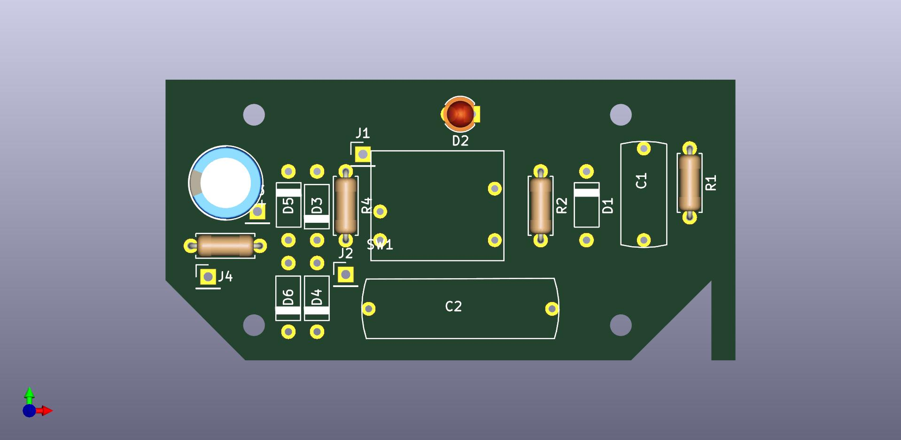
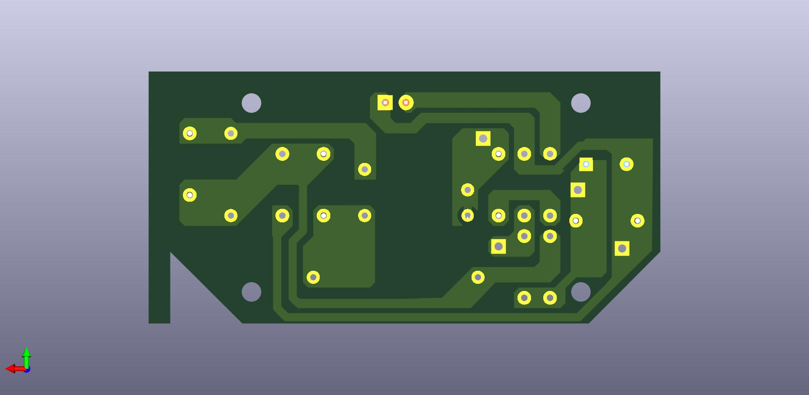

# LED Lamp Rev. Engineering

## Description

Made on KiCad using manual measurements without consulting official schematics for study purposes.

You may find the pdf version of the  in *./extra* folder.

Used a *Pelicano LED* from LLUM for reference, you can check it [at this catalog][catalog].

[catalog]: http://www.bronzearte.com.br/marketing/catalogo.pdf#page=59
